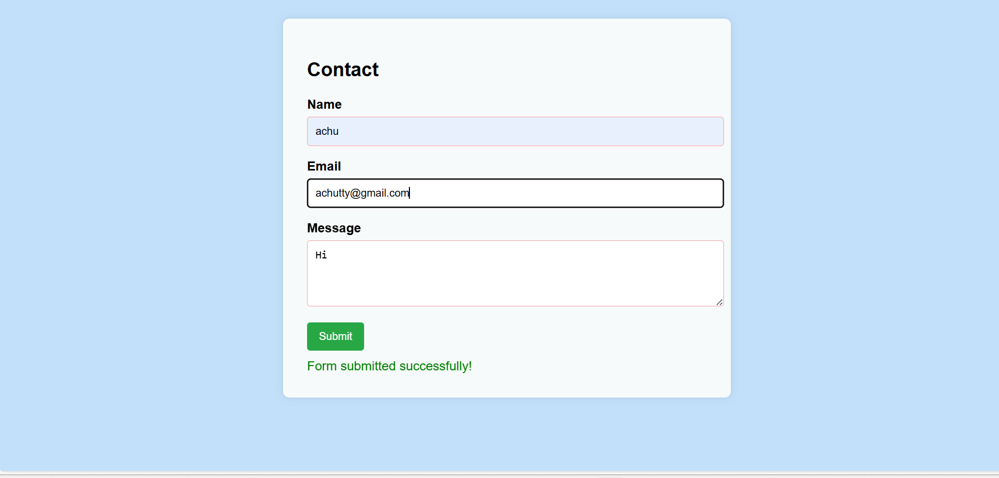
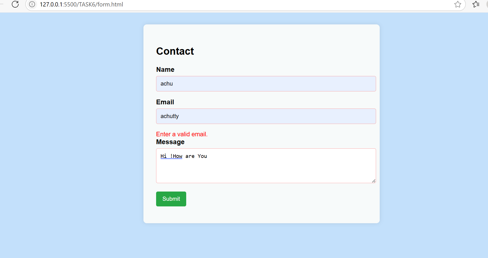

# Contact Form with Validation

This is a simple contact form built using HTML, CSS, and JavaScript. It includes client-side validation for the Name, Email, and Message fields.

## Features
- Input validation on form submit
- Error messages for empty or invalid inputs
- Success message on valid submission
- Simple and clean UI

## How to Use
1. Open `contact-form.html` in your browser.
2. Fill out the form and click **Submit**.
3. You'll see error messages for invalid inputs or a success message if everything is valid.

## Screenshots

### 🖼️ Full Form View &Success message

### 🖼️ Validation Errors

### 🖼️ Success Message

> 📂 Place your screenshots in a `screenshots/` folder inside the project directory.

## File
- `contact-form.html` – All code (HTML, CSS, JavaScript) in one file

## Credits
Made with 💻 using VS Code and Chrome.
